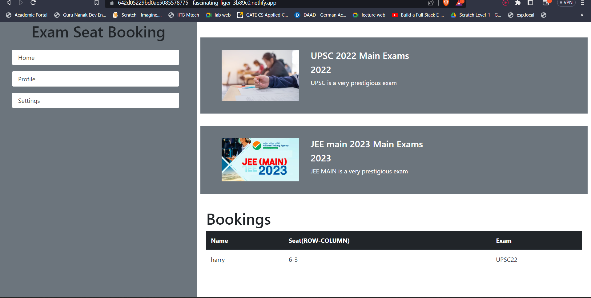
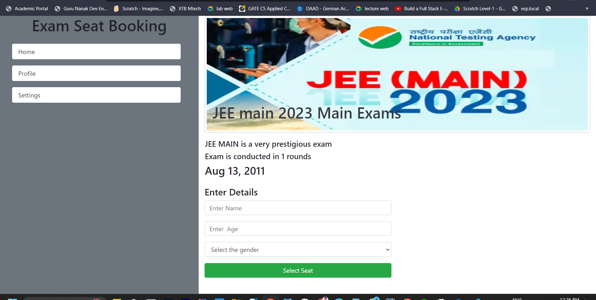
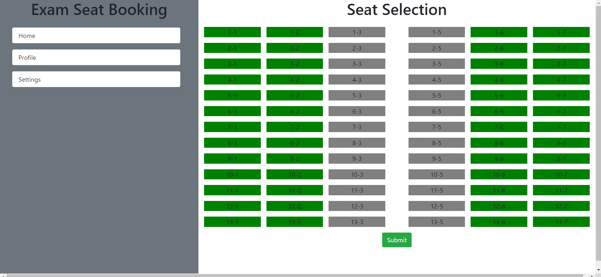

# Exam Booking App

## ```I have created  backend api  and deployed on render as the api given in assesment doc says this and is exhausted.```

- This is the backend api url : https://exam-booking.onrender.com/data

- This gives the response as an array of objects for exam details


## This application has 3 views
- Home
- Exam Details
- Booking

### Home
- User can See All the Exam Details here and can see bookings as well.
 - Here now all the details of booking are shown 
 
 ### ExamDetails
 - Here User can see the particular exam details and can fill his info for selecting the seat

 ## Booking
 - Here User can book the exam seat by selecting the seat and data is stored in local storage as an array of objects to retain all the data.
 


 